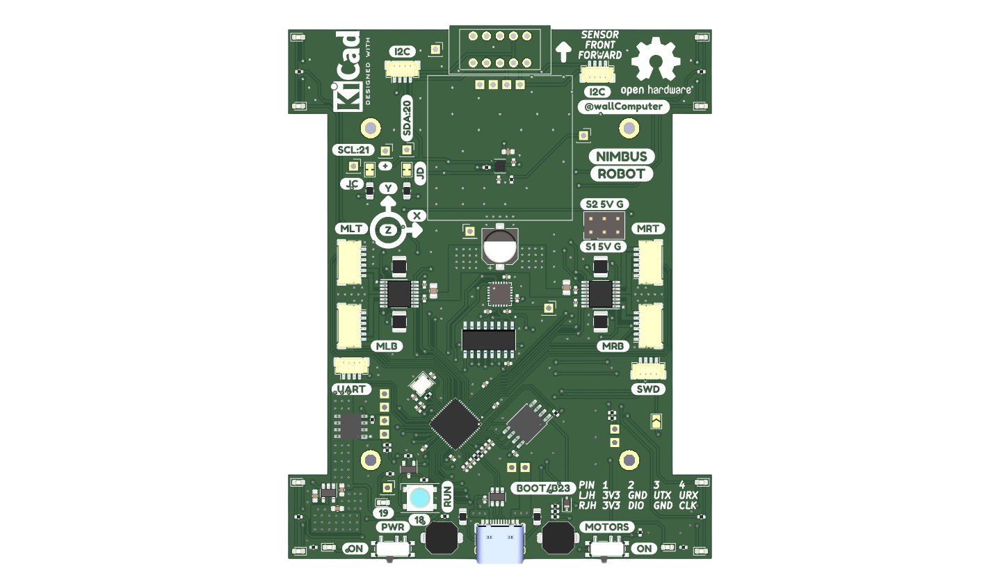
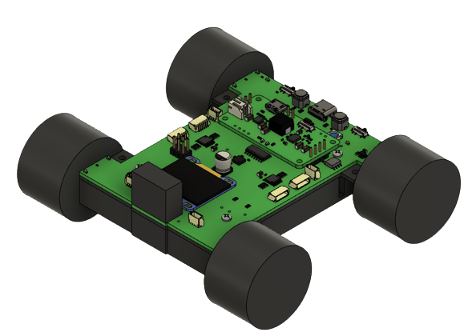
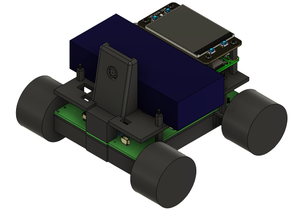

# Nimbus Robot 

# Description
This project is centered around the Raspberry Pi RP2040 based robot I designed in June of 2022. 
Previously, I had made another small size wheeled robot, the PiZumo Robot. Unfortunately it has 
issues, and I thought making a simpler robot would be a way to find if I can eliminate these issues 
and make something more fun and easier to programme. This design also separates the Raspberry Pi
from the main robot.

                                    PCB Designed in KiCad

 
                                            Base Robot

                                Robot with Raspberry Pi and Camera

## Features
The main robot itself has the following features:

- Powered from a 2000mAh 3.3V Lipo Battery.
- PowerBooster to charge and Boost the Battery to 5.17V.
- On Board P-Channel MOSFET and Power switch to turn the robot power on and off.
- Raspberry Pi RP2040 for main controller.
- 16MB onboard FLASH.
- Battery Charging from USB-C. 
- 2x Motor Controllers for controlling 4 DC motors.
- Encoder Inputs for each motor.
- Single Switch to control Motor Power.
- Two 3 Pin Servo Headers.
- Headers for I2C, UART, and SWD pins.
- MPU-6050 for Accelerometer and Gyroscope.
- LIS2MDL for Magnetometer.
- OLED Header.
- Forward facing Pimoroni I2C Breakout Garden Header. (Populated with [VL53L5CX](https://shop.pimoroni.com/products/vl53l5cx-time-of-flight-tof-sensor-breakout?variant=39972903059539) distance sensor).
- RGB Neopixel WS2812B.
- BLUE User LED.
- User Button Combined with BOOT Button.
- Reset Button.
- LEDs for forward and Backward Control Indication per wheel.
- Jumpers to control Current Limits on the motor, MPU-6050 Address, I2C Pull-Up Resisitors.
- ADC demuxing for Current sensing on each Motor, Fault registering for each Motor Control, Voltage level measuring for Battery Input and PowerBooster output.

## Pinout
For pinouts, refer to [PINOUTS.md](PINOUTS.md), for example, one can find pin connections for Motors in 
[Motor Section](PINOUTS.md#motor-connections), and those for ADC in its own [ADC section](PINOUTS.md#adc).

## Hardware 
There is a separate github repository for the hardware files. Please refer to them for Kicad Schematics, PCB Layouts, project libraries, step files, and component lists.

## Software Examples:
1. [Blink Blue LED](Example_001_LED/.README.md)
2. [NEOPIXEL](Example_002_NEOPIXEL/.README.md)
3. OLED
4. [Basic Motor Control](Example_004_MOTORS_BASIC/.README.md)
5. Motor Control with Encoder
6. MPU-6050 Code
7. LIS2MDL Bearing
8. [VL53L5CX](https://shop.pimoroni.com/products/vl53l5cx-time-of-flight-tof-sensor-breakout?variant=39972903059539) Distance Sensor.
9. ADC with 74LV4051D
10. Servo Motor Control