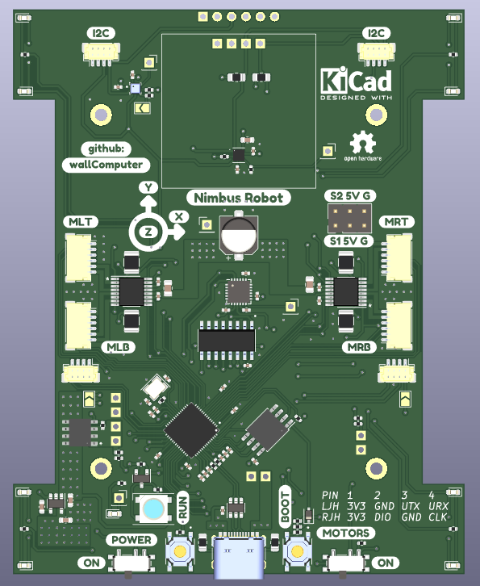
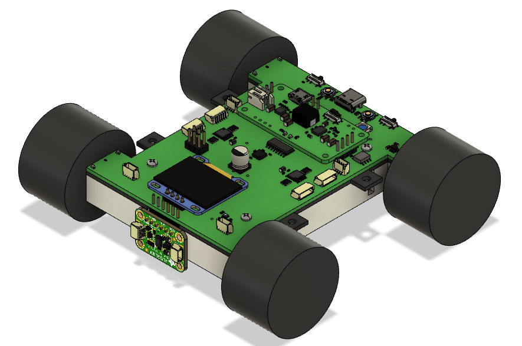

# Nimbus Robot 

# Description
This project is centered around the Raspberry Pi RP2040 based robot I designed in June of 2022. 
Previously, I had made another small size wheeled robot, the PiZumo Robot. Unfortunately it has issues, and I thought making a simpler robot would be a way to find if I can eliminate these issues and make something more fun and easier to programme.

Kicad PCB View

Fusion 360 Design for chassis.

## Features
The robot has the following features:

- Powered from a 2000mAh 3.3V Lipo Battery.
- PowerBooster to charge and Boost the Battery to 5.17V.
- On Board P-Channel MOSFET and Power switch to turn the robot power on and off.
- Raspberry Pi RP2040 for main controller.
- 16MB onboard FLASH.
- Battery Charging from USB-C. 
- Four DC Motor Control with 2-channel encoder input and ~280mA current limit on each motor. 
- Two 3 Pin Servo Headers.
- Headers for I2C, UART, and SWD pins.
- MPU-6050 for Accelerometer and Gyroscope.
- LIS2MDL for Magnetometer.
- BMP388 for Pressure/Altitude/Height above Ground measurement.
- OLED Header
- VL53L0X header for front distance sensing.
- RGB Neopixel WS2812B
- BLUE LED
- User Button Combined with BOOT Button
- Reset Button
- LEDs for forward and Backward Control Indication.
- ADC demuxing for Current sensing on each Motor, Fault registering for each Motor Control, Voltage level measuring for Battery Input and PowerBooster output.

## Pinout
For pinouts, refer to [PINOUTS.md](PINOUTS.md), for example, one can find pin connections for Motors in [Motor Section](PINOUTS.md#motor-connections) section, and those for ADC in its own [section](PINOUTS.md#adc).

## Hardware 
There is a separate github repository for the hardware files. Please refer to them for Kicad Schematics, PCB Layouts, project libraries, step files, and component lists.

## Software Examples:
1. [Blink Blue LED](Example_001_LED/.README.md)
2. Fade NEOPIXEL
3. OLED
4. Basic Motor Control
5. Motor Control with Encoder
6. MPU-6050 Code
7. LIS2MDL Bearing
8. BMP388 Pressure Sensor
9. VL53L0X Distance Sensor
10. ADC with 74LV4051D
11. Servo Motor Control